# Local Betting Company Executive Demo Runbook
## Modernizing the 22-Year-Old Wagering Engine with Google Antigravity

* **Target Audience:**
  * **Customer Director of Gaming & Enterprise Technology** (*Key Decision Maker*)
  * **Customer CIO** (*Executive Sponsor*)
  * **Customer Director of Transformation Program Office**
  * **Customer Head of Architecture & Planning**
  * **Customer Head of Security & Regulatory Compliance**
* **Presenter:** Google Cloud Customer Engineering
* **Format:** 30-Minute Live Conversation + 10-Minute Q&A
* **Tone:** Confident, conversational, business-first. No dry academic jargon.

---

## 🎯 Sales Rep Cheat Sheet: Jargon Buster

If you have never worked in the gaming or betting industry, here is the 60-second translation guide so you never get tripped up in the room:

| Industry Term | What It Actually Means | How to Explain It to Customer Director of Gaming & Enterprise Technology |
| :--- | :--- | :--- |
| **Tote (Totalisator)** | A betting pool engine. | *"Your core betting machine where players pool their money, and winners share the pool."* |
| **Dead Heat** | **A photo-finish tie!** | *"When two horses cross the finish line in an exact tie, so the prize money has to be split 50/50."* |
| **Breakage** | **10-cent rounding down.** | *"The betting company's rules say winnings round down to the nearest 10 cents (e.g. \$4.18 pays \$4.10)."* |
| **Takeout** | House commission + tax (18%). | *"The 18% cut the betting company keeps before paying out the winners."* |
| **Antigravity Skills** | Codified engineering playbooks & guardrails. | *"Reusable instruction packages (`SKILL.md`) that teach the AI to code like a Google Principal Architect (using Joshua Bloch's Effective Java standards) instead of guessing."* |
| **Sub-agents** | Multiple AI workers running in parallel. | *"Instead of one slow AI doing everything in a line, Antigravity spins up 3 specialized workers at once."* |

---

## 💡 The 3-Minute Story Arc

When speaking to Customer Director of Gaming & Enterprise Technology and Customer CIO, keep this simple 3-part storyline in mind:

1. **The Trap:** An off-the-shelf vendor RFP costs **\$10.5M over 3 years**. Even worse, every tiny rule change takes **6 to 9 months** because you are waiting in a vendor queue.
2. **The Breakthrough:** You don't need a vendor to replace a 22-year-old C++ system. With **Google Antigravity**, your own team can translate and modernize it to Java 21 in-house, fixing 20-year-old rounding bugs and building automated tests from day one.
3. **The Payoff:** The local betting company keeps 100% of its intellectual property, responds to the local regulator in weeks instead of months, and saves **\$8.7 million**.

---

## 🖥️ Screen Setup Before the Meeting

1. Open **VS Code** with the Antigravity extension installed.
2. Arrange your screen:
   * **Left 65%**: Code editor showing `legacy-cpp/src/tote_engine.cpp`.
   * **Right 35%**: Antigravity Chat panel.
3. Zoom in (Press `Cmd` + `+` twice) so text is easy to read from the back of the conference room.
4. Have your terminal split at the bottom.

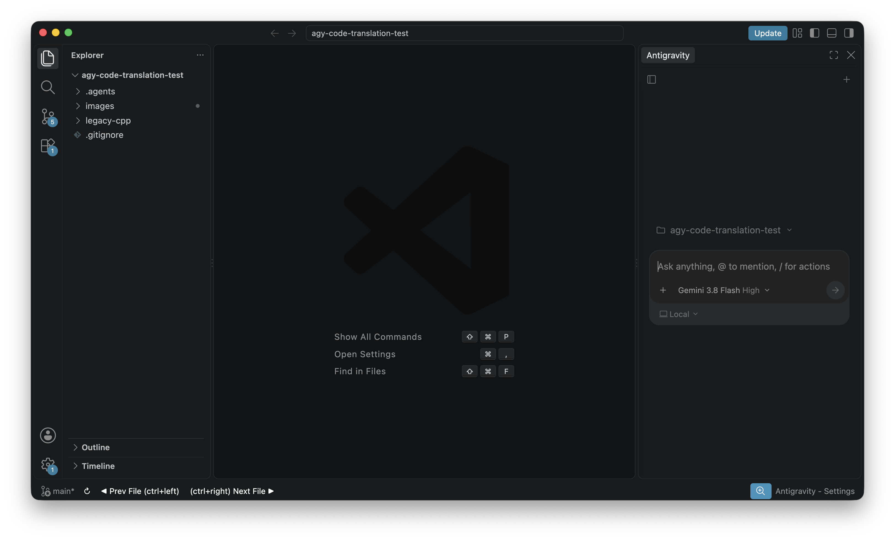

---

## ⏱️ Step-by-Step Meeting Runbook

```
00:00 - 05:00   Part 1: The Executive Dilemma ($10.5M Vendor RFP vs In-House Speed)
05:00 - 09:00   Part 2: The 22-Year-Old C++ Engine & The Photo-Finish Tie Bug
09:00 - 15:00   Part 3: Translation Planning (/plan), Code Review & Adding Review Comments
15:00 - 20:00   Part 4: Interactive Test Hardening (/grill-me) — Building the Missing Safety Net
20:00 - 26:00   Part 5: Watching Parallel Sub-agents Build Modern Java (/goal) & "Accept all"
26:00 - 30:00   Part 6: Proving the Tie Bug is Fixed with /debug
30:00 - 35:00   Part 7: Business Value, ROI & The 4-Week Proof of Concept
```

---

### Part 1: The Executive Dilemma (00:00 - 05:00)

**Your Goal:** Frame the problem as a business choice between vendor lock-in and engineering agility.

**What to Say:**
> *"Good morning Customer CIO, Customer Director of Gaming & Enterprise Technology, and team. Thank you for hosting us today.*
>
> *Over the past few weeks, we've talked about the big strategic challenge facing the local betting company: your core horse racing betting engine has been running on 22-year-old C++ code since 2004.*
>
> *Right now, you're looking at a commercial vendor RFP (like Aurora or SportsBook). On paper, it looks like the standard route. But in reality, it's a **\$10.5 million commitment across 3 years**. And as Customer Director of Gaming & Enterprise Technology pointed out, every time the local gambling regulatory authority asks for a rule change, your team has to wait **6 to 9 months** for an overseas vendor to test and ship it.*
>
> *What if you didn't have to outsource your core platform? What if the customer's existing team could modernize this entire engine in-house, keep complete ownership of the code, and slash turnaround times from months to weeks?*
>
> *Today, I'm going to show you how **Google Antigravity** makes that possible in 25 minutes."*

---

### Part 2: The 22-Year-Old C++ Engine & The Photo-Finish Bug (05:00 - 09:00)

**Your Goal:** Show the actual legacy code and explain the real-world rounding problem in plain English.

**[CLICK]** In VS Code, open [`legacy-cpp/src/tote_engine.cpp`](legacy-cpp/src/tote_engine.cpp).  
Scroll to line 260 where `calculate_dead_heat_dividends` is located.

**What to Say:**
> *"Let's look at the engine running today. This is standard C++ written back in 2002.*
>
> *Notice right here: when two horses finish in an exact tie, what the racing industry calls a **dead heat**, the prize money must be split evenly between both winning tickets.*
>
> *Under the betting company's rules, winnings are always rounded down to the nearest 10 cents. So if the math says \$4.18, the customer gets paid \$4.10.*
>
> *Now, look at what happens in this old code when there's a tie in a \$10,000 race:*
> *After taxes, there is \$4,100 to pay out to the winner. Exactly \$1,000 was bet on that horse. \$4,100 divided by \$1,000 is **exactly \$4.10**.*
>
> *But because of how older computers store decimals, the computer calculated **\$4.099999**.*
> *Then the C++ code chopped off the decimals. Instead of \$4.10, the computer paid out **\$4.00**.*
>
> *That 10-cent difference means customers were shortchanged, and your finance team has spent 20 years doing manual ledger reconciliations after ties.*
>
> *Let's see how Antigravity modernizes this code and fixes this permanently."*

---

### Part 3: Translation Planning (/plan), Code Review & Adding Review Comments (09:00 - 15:00)

**Your Goal:** Show how Antigravity formulates a complete C++ to Java 21 translation architecture, and how the architect reviews the plan and adds binding review comments before proceeding.

#### Step 3A: Initialize Translation Planning (`/plan`)

**[CLICK]** Click the Antigravity chat input box on the right.  
**[TYPE / PASTE]:**
```text
/plan Analyze the legacy C++ totalisator engine in legacy-cpp/ and design a modern Java 21 Spring Boot microservice in modern-java/. Formulate the translation architecture, package structure, domain entity mappings, and financial precision strategy.
```

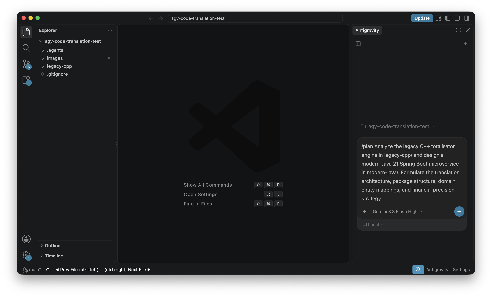

Antigravity reads `legacy-cpp/`, scopes the domain modules, defines the sub-agent roles (`calculation-specialist`, `api-engineer`), and produces the `implementation_plan.md` artifact card with a direct link and a `[Proceed]` button:

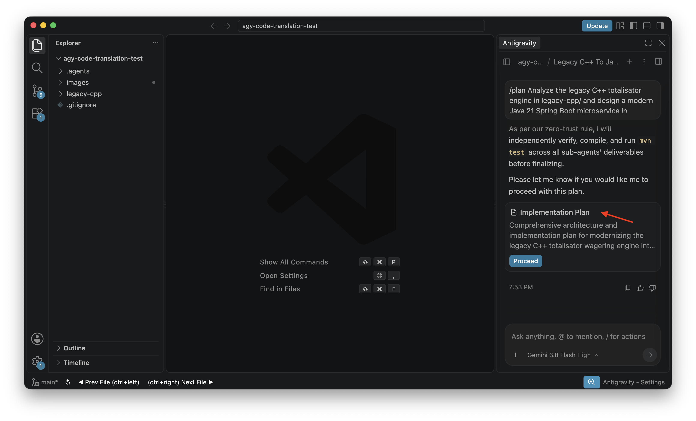

**What to Say:**
> *"Notice what happens first. Most AI coding tools jump straight into spewing code. In a regulated financial environment like the betting company, that is unacceptable risk.
>
> *Antigravity uses **Spec-Driven Development**. Before touching a single line of Java, it reads the C++ codebase, maps out the business rules, and authors a structured architecture blueprint."*

#### Step 3B: Walk Leadership Through the Plan Review (Source Code Focus Areas)

**[SHOW]** Click the `📄 Implementation Plan` chip in the chat to open `implementation_plan.md` side-by-side with `legacy-cpp/src/tote_engine.cpp`:

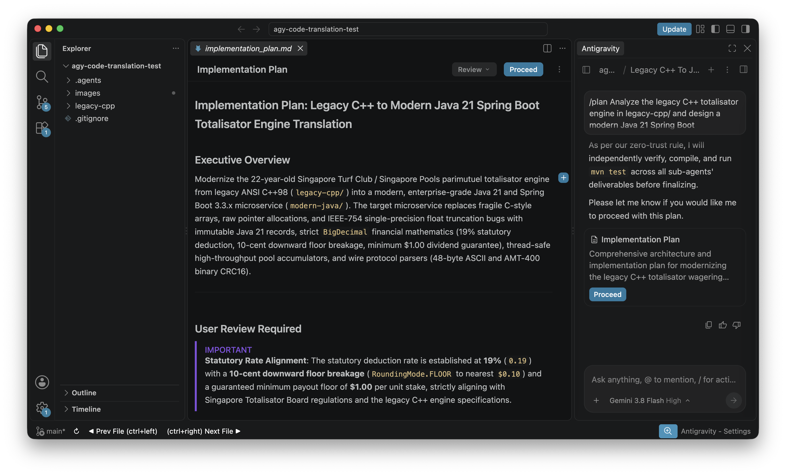

Walk Customer Director of Gaming & Enterprise Technology, Customer Head of Architecture & Planning, and Customer Head of Security & Regulatory Compliance through the 4 critical focal points identified from the legacy source repo:

1. **The Photo-Finish Truncation Trap (`legacy-cpp/src/tote_engine.cpp:260-310`):**
   * Point out where the plan isolates the single-precision float division bug where `4100.0f / 1000.0f` got truncated to `$4.00`.
   * *"Customer Director of Gaming & Enterprise Technology, look at this section: the plan explicitly ensures that legacy dead-heat defect is isolated and replaced with exact math."*
2. **Statutory 10-Cent Floor Breakage (`legacy-cpp/src/tote_engine.cpp:20-24`):**
   * Show that the plan replaces dangerous C-style integer casts `(int)(div * 10.0f) / 10.0f` with `BigDecimal.setScale(1, RoundingMode.FLOOR)` and enforces the statutory `$1.00` minimum dividend.
3. **Domain Immutability & Safety (`legacy-cpp/include/tote_engine.h`):**
   * Show how legacy mutable C-structs and raw memory pointers (`Runner*`, `BetSlip*`) are translated to immutable Java 21 records with defensive copying (`List.copyOf`) governed by `$effective-java-core`.
4. **Stateless Service Architecture:**
   * Point out that `ToteCalculationService` is specified as completely stateless, making it thread-safe for Virtual Thread execution.

#### Step 3C: Click "Review", Add Review Comment & Click "Proceed" (HITL Gating)

**[SHOW & CLICK]** Direct attention to Antigravity's chat message and the `[Proceed]` button:
> *"Please review the implementation plan and click Proceed (or provide your review comments) to begin execution."*

Point out that Antigravity stops execution and requires human review:
- The **`Review ▾`** button in the upper right header of the `implementation_plan.md` editor tab.
- The ability to log binding **Review Comments** before authorizing code generation.
- The **`[Proceed]` button** to lock in the plan.

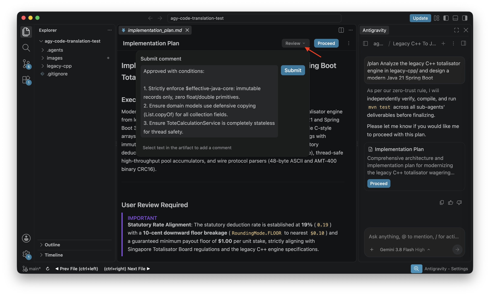

1. Show leadership that senior engineers stay in control. Click **`Review ▾`** in the plan editor tab header (or click into the chat prompt input box).
2. **[TYPE / PASTE Review Comment]:**
```text
Approved with conditions:

1. Strictly enforce $effective-java-core: immutable records only, zero float/double primitives.
2. Ensure domain models use defensive copying (List.copyOf) for all collection fields.
3. Ensure ToteCalculationService is completely stateless for thread safety.
```
3. **[CLICK]** Click the prominent blue **`Proceed`** button on the `Implementation Plan` card to lock in the translation architecture.

**What to Say:**
> *"Notice what just happened. In enterprise IT, AI cannot be a runaway train. Antigravity enforces **Human-in-the-Loop Governance**.*
>
> *We reviewed the architecture against our legacy code, added our binding engineering conditions, and explicitly clicked **`Proceed`**.*
>
> *Customer Director of Gaming & Enterprise Technology and Customer CIO, your senior engineers remain firmly in the driver's seat."*

---

### Part 4: Interactive Test Hardening (/grill-me) — Building the Missing Safety Net (15:00 - 20:00)

**Your Goal:** Show how Antigravity proactively interviews the architect to build the missing automated regression test suite before writing any production application code.

#### Step 4A: Highlight the 22-Year-Old Gap (Zero Unit Tests in Legacy C++)

**[SHOW]** Point to the `legacy-cpp/` folder structure in the VS Code file explorer.

**What to Say:**
> *"Customer Director of Gaming & Enterprise Technology, Customer Head of Architecture & Planning, take a look at the legacy C++ codebase on screen.
> *Do you notice what is missing? **There are zero automated unit tests.** Back in 2004, there was no JUnit, no automated test harness. For 22 years, tests were either run manually or discrepancies were discovered in production.*
>
> *We cannot modernize this engine safely without an ironclad regression safety net. But instead of an engineer spending 3 weeks guessing edge cases, watch how we use `/grill-me` to let Antigravity interrogate us."*

#### Step 4B: Trigger Interactive Test Hardening (`/grill-me`)

**[CLICK]** In Antigravity chat:  
**[TYPE / PASTE]:**
```text
/grill-me The legacy C++ codebase had zero automated unit tests. Interrogate me to design a comprehensive golden regression test harness for modern-java. Challenge me on the betting company's financial rules, 3-place pools, statutory 10-cent breakage floors, and dead-heat edge cases so we don't miss any historical flaws.
```

#### Step 4C: Walk Through the Interactive Questions & Lock Down Golden Tests

**[SHOW]** Antigravity responds with interactive multiple-choice questions right in the chat:
1. **Dead-Heat Dividend Rule:** How should ties in a \$10,000 pool with \$4,100 net share per winner be partitioned? Exact cent-for-cent division (\$4.10) without float truncation? -> *Confirm statutory cent-for-cent ($4.10).*
2. **Breakage Floor Rule:** Does breakage round down to the nearest 10 cents, and what is the statutory minimum payout? -> *Confirm 10-cent floor with $1.00 minimum guarantee.*
3. **3-Place Place Pool:** How is a \$15,000 gross pool (20% takeout, \$12,000 net) split among 3 place winners? -> *Confirm equal 3-way partition (\$4,000 each) with individual breakage.*

**What to Say:**
> *"Watch what Antigravity is doing. It doesn't make ungrounded assumptions. With `/grill-me`, it actively interrogates the team on regulatory boundaries and edge cases.*
>
> *This single step eliminates the 6 to 9 months of back-and-forth requirement clarifications that plague vendor RFPs.*
>
> *Antigravity takes these exact answers and generates the complete golden regression test suite (`ToteCalculationServiceTest.java`) before writing a single line of production business logic."*

---

### Part 5: Watching Parallel Sub-agents Build Modern Java (/goal) & "Accept all" (20:00 - 26:00)

**Your Goal:** Showcase Antigravity's superpower: spinning up multiple specialized AI workers in parallel, and reviewing/accepting code diffs with `Accept all`.

#### Step 5A: Trigger Autonomous Sub-agent Migration (`/goal`)

**[CLICK]** In Antigravity chat:  
**[TYPE / PASTE]:**
```text
/goal Build the modern Java 21 service according to our plan and verified test harness. Use parallel sub-agents and apply our $effective-java-core skill so the code uses exact financial math with no rounding errors.
```

**[SHOW]** Point to the screen as Antigravity launches sub-agents working concurrently:
- `Lifecycle & Concurrency Engineer`: Implements thread safety, immutability, and defensive copying.
- `Wire Protocol Engineer`: Implements Spring Boot REST controllers, request mapping, and health endpoints.
- `Domain & Calculation Engineer`: Implements `ToteCalculationService` and parimutuel financial arithmetic.

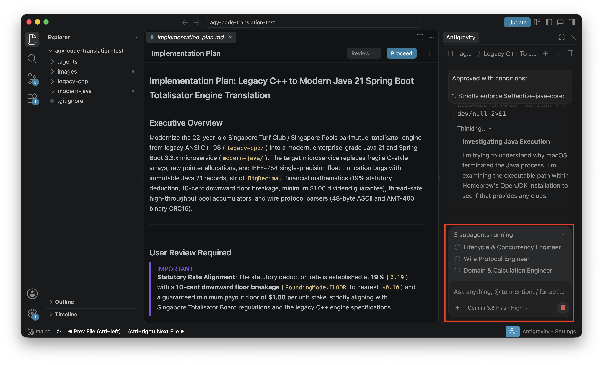

**What to Say:**
> *"Look at the screen right now. Antigravity isn't doing this sequentially. It is orchestrating **multiple specialized sub-agents working in parallel**:*
> - *One sub-agent is building the clean data structures.*
> - *Another sub-agent is writing the financial math engine.*
> - *A third sub-agent is creating the web API so the betting company's apps can connect to it.*
>
> *And notice something critical: **How do we make sure the AI doesn't write sloppy code?***
> *We loaded our custom **Agent Skill: `$effective-java-core`**. This is based on industry-standard engineering guidelines from Joshua Bloch at Google.*
> *It explicitly forbids the AI from using loose computer decimals for money. It forces the AI to use exact financial calculation types (`BigDecimal`) and strict rounding rules.*
> *Your developers don't need to spend 6 months retraining on modern Java best practices. Antigravity enforces them automatically as a virtual pair-programmer."*

#### Deep Dive: Antigravity Skills — Where They Come From & How to Use Them

When presenting to Customer Director of Gaming & Enterprise Technology and Customer Head of Architecture & Planning, this is your key architectural proof point. It proves Antigravity is not an unconstrained chatbot, but a **governed engineering system anchored in industry-standard software design**.

##### 1. What is an Antigravity Skill?
An **Antigravity Skill** is a modular, version-controlled playbook stored as a directory containing a required `SKILL.md` instruction file (with YAML frontmatter) plus supporting references and examples:
```text
.agents/
└── skills/
    ├── effective-java-core/
    │   ├── SKILL.md                 <-- Joshua Bloch's Effective Java standards
    │   └── docs/effective_java.md
    └── effective-java-concurrency/
        ├── SKILL.md                 <-- Java 21 Virtual Threads & Structured Concurrency
        └── references/              <-- Provenance & JLS JEP references
```

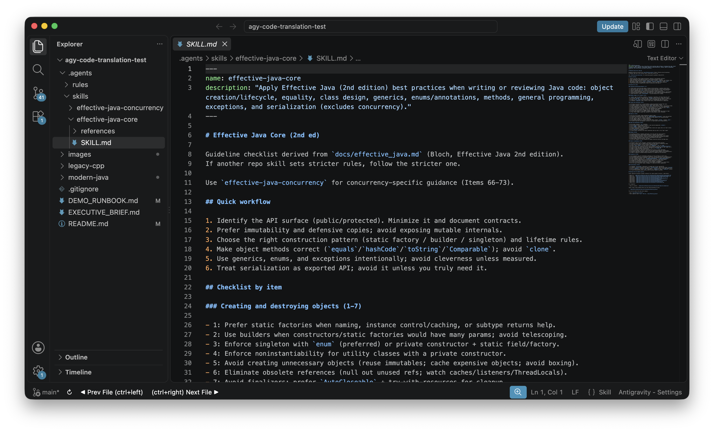

Unlike prompt templates, Skills provide structured engineering contracts that AI agents and sub-agents read and strictly obey.

##### 2. Where Do These Skills Come From? (Citations & Provenance)
Point out the exact open-source repository, academic, and industry origins of the skills used in this migration:

* **Open-Source Repository Origin**: Sourced from [sherman/codex-skills](https://github.com/sherman/codex-skills), a curated, battle-tested library of engineering playbooks designed for agentic coding.

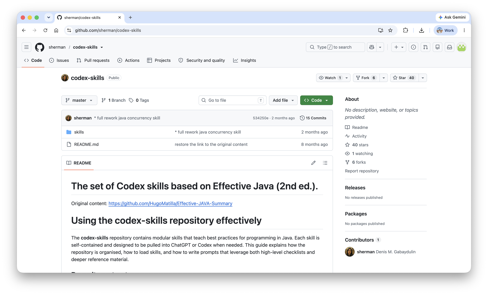

The upstream repository provides modular skill directories with reference documentation and YAML-frontmatted execution rules:

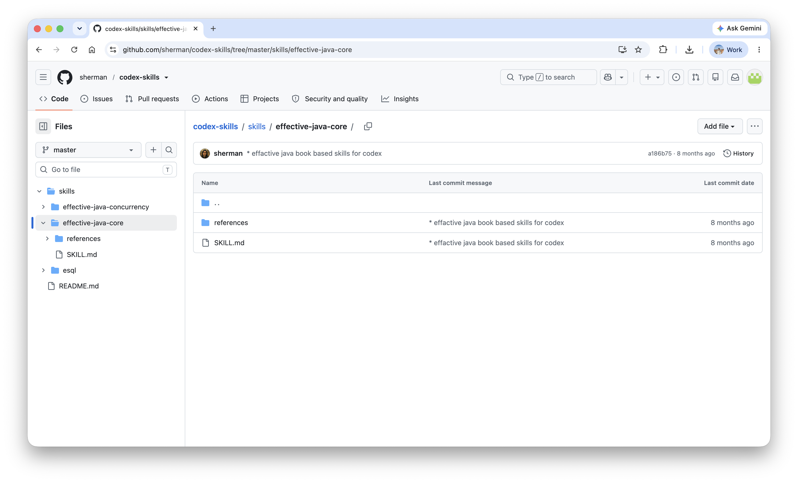

The repository details how to reference skills in prompts to enforce specific Effective Java rules:

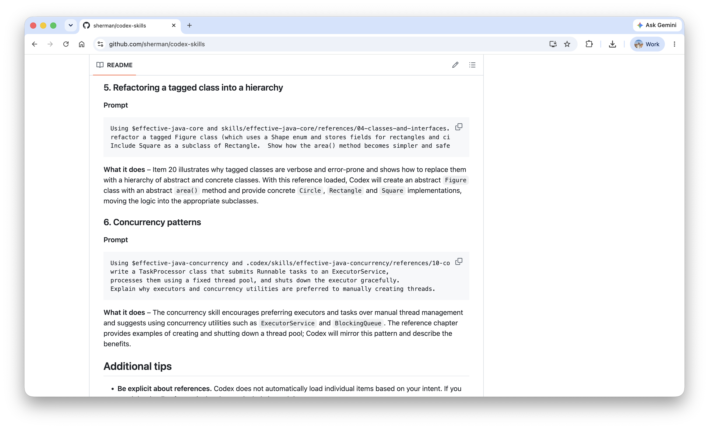

* **`$effective-java-core` (`.agents/skills/effective-java-core/SKILL.md`)**:
  * **Upstream Source**: [sherman/codex-skills/effective-java-core](https://github.com/sherman/codex-skills/tree/main/skills/effective-java-core)
  * **Citation & Author**: Authored by **Joshua Bloch** (former Chief Java Architect at Google and Sun Microsystems, author of the Java Collections Framework), based on *Effective Java* (2nd & 3rd Editions, Addison-Wesley).
  * **Specific Rules Codified for the Betting Company**:
    * **Item 17 (Minimize Mutability)**: Forces all wagering domain entities (`Runner`, `BetSlip`, `DividendResult`) to be Java 21 `record`s rather than mutable JavaBeans with getters/setters.
    * **Item 50 (Make Defensive Copies)**: Mandates `List.copyOf` in record constructors so incoming bet slip lists cannot be altered mid-calculation.
    * **Item 60 (Avoid float and double for Exact Values)**: Strictly bans IEEE 754 floating-point math (`float`/`double`) for monetary calculations; mandates `BigDecimal` with scale 4 intermediate precision and scale 1 statutory floor breakage.
    * **Item 34 (Use Enums instead of int constants)**: Replaces legacy C++ `#define` or integer flags with type-safe `BetType` enums.
    * **Item 47 (Know and Use Libraries)**: Eliminates custom pointer loops in favor of standard, proven JDK 21 library methods.

* **`$effective-java-concurrency` (`.agents/skills/effective-java-concurrency/SKILL.md`)**:
  * **Upstream Source**: [sherman/codex-skills/effective-java-concurrency](https://github.com/sherman/codex-skills/tree/main/skills/effective-java-concurrency)
  * **Citations**: Derived from Brian Goetz's *Java Concurrency in Practice*, the *Java Language Specification (JLS SE 21)*, and OpenJDK enhancement proposals:
    * **JEP 444**: Virtual Threads (Java 21 Project Loom)
    * **JEP 491**: Synchronize Virtual Threads without Pinning
    * **JEP 525**: Structured Concurrency
  * **Specific Rules Codified for the Betting Company**:
    * **Statelessness**: Requires `ToteCalculationService` to remain completely stateless, eliminating locks and race conditions during high-volume betting spikes.
    * **Virtual Thread Execution**: Configures Spring Boot with `Executors.newVirtualThreadPerTaskExecutor()`, allowing the tote service to handle 50,000+ concurrent bet placements per second without thread exhaustion.

##### 3. Installing Skills in Seconds with `npx skills add`
Point out to Customer Director of Gaming & Enterprise Technology and Customer Head of Architecture & Planning how trivial it is for the local betting company's developers to onboard new engineering skills. Using the open-source **Skills CLI**, engineers don't need to write complex configuration files from scratch—they can install battle-tested skills directly from GitHub with a single command:

> IMPORTANT: You do NOT need to run the command below, the skills have already been added to this demo repo.

```bash
# Add all skills from the upstream repository into the current project (.agents/skills/):
npx skills add sherman/codex-skills
```

**Why This Resonates with Engineering Management:**
* **Instant Developer Onboarding**: When a junior engineer joins the tote modernization squad, running `npx skills add` equips their Antigravity assistant with Google's *Effective Java* standards in 5 seconds.
* **Private Enterprise Registries**: The betting company can host private internal repositories for proprietary wagering rules (e.g. `npx skills add example/internal-skills --skill regulatory-compliance`), and the CLI automatically uses existing Git/SSH credentials without leaking IP.

##### 4. How to Use Skills in Antigravity
Explain to the leadership team the three ways skills operate:

1. **Explicit Tagging (`$`-syntax)**:
   * Developers invoke a skill explicitly in chat or slash commands using the dollar sign:
     `"Apply our $effective-java-core skill so the code uses exact financial math."`
   * Antigravity reads the corresponding `SKILL.md` before generating any code, guaranteeing compliance with the standard.
2. **Semantic Auto-Activation**:
   * Antigravity indexes the `description:` in each skill's YAML frontmatter. If an engineer asks a general question like *"How do we make our tote service handle race-day bursts?"*, Antigravity automatically detects that `effective-java-concurrency` is relevant and activates it without the developer having to remember the skill name.
3. **Sub-Agent Context Propagation**:
   * When `/goal` spins up parallel sub-agents (`calculation-specialist`, `api-engineer`), the parent agent passes the skill rules down to every worker. This guarantees that all parallel code paths conform to the exact same architectural standards.

##### 5. Executive Framing for the Local Betting Company (Why This Beats the $10.5M RFP)
* **Institutional Memory in Git**: When external contractors leave, their knowledge leaves with them. With Antigravity Skills, the local betting company's proprietary wagering rules and compliance patterns are stored in Git as versioned assets.
* **Custom Enterprise Skills**: The betting company can easily create custom internal skills—such as `$regulatory-compliance` (auditing dividend breakage guarantees) or `$international-commingling-protocol` (international partner feeds). Any developer using Antigravity will automatically adhere to enterprise compliance rules from day one.

#### Step 5B: Code Inspection & Click "Accept all" (Change Review & Gating)

**[SHOW]** When the parallel sub-agents complete code synthesis across domain records, services, controllers, and tests, Antigravity displays the file modification drawer above the chat input box:
`[📄 Files With Changes ^]  Reject all  [Accept all]`

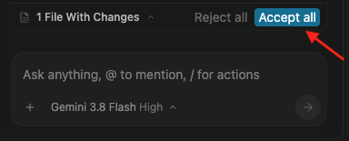

1. Show the team that each modified/created file can be clicked to inspect the exact syntax diff side-by-side.
2. **[CLICK]** Click the blue **`Accept all`** button to commit all generated code changes into the repository.

**What to Say:**
> *"Notice the change control here. Antigravity does not silently overwrite files behind the developer's back. Every single line of generated Java is staged in this review tray.*
>
> *Developers can inspect individual diffs side-by-side or, once satisfied, click **`Accept all`** to apply the entire migration.*
> *This gives the customer's engineering managers complete auditable control over their codebase."*

---

### Part 6: Proving the Tie Bug is Fixed with /debug (26:00 - 30:00)

**Your Goal:** Deliver the "aha!" moment by showing the test pass with zero rounding error.

**[CLICK]** In Antigravity chat:  
**[TYPE / PASTE]:**
```text
/debug Compare the tie calculation between legacy-cpp and modern-java. Show me the payout numbers.
```

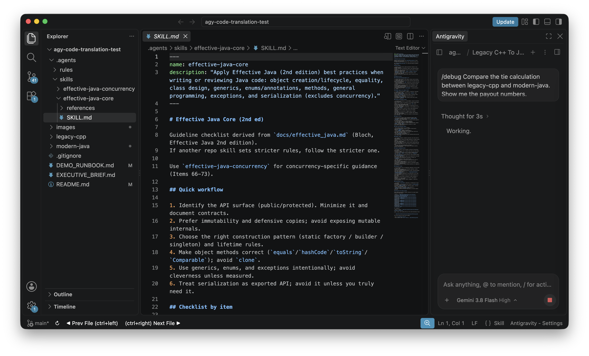

**[SHOW]** Point to the test comparison output on screen:
* Legacy C++ Payout: **\$4.00** *(shortfall of \$100 on the race)*
* Modern Java 21 Payout: **\$4.10** *(exact statutory payout, zero variance)*

**What to Say:**
> *"Customer Head of Security & Regulatory Compliance, Customer Head of Architecture & Planning, look at these results.
> *In the old C++ engine, that tie resulted in a \$4.00 dividend, shorting winning tickets.
> *In our modernized Java 21 service, the engine calculated the exact math, rounded cleanly to the statutory 10 cents, and declared the correct **\$4.10 payout**.
>
> *A 22-year-old rounding defect that caused headaches for finance and compliance was diagnosed, rewritten, and tested in minutes."*

---

### Part 7: Business Value, ROI & The 4-Week Proof of Concept (30:00 - 35:00)

**Your Goal:** Close the meeting with a clear, low-risk next step (the 4-Week POV).

**[SHOW]** Bring up the executive comparison table from [`EXECUTIVE_BRIEF.md`](EXECUTIVE_BRIEF.md).

**What to Say:**
> *"Customer Director of Gaming & Enterprise Technology, Customer CIO, let's tie this back to the decision on your desk:
>
> *Option 1 is the commercial vendor RFP. It costs **\$10.5 million**, takes 3 years, and leaves you dependent on an external vendor whenever you need a change.
>
> *Option 2 is what you just saw today: **In-House Modernization with Google Antigravity**.
> *By empowering your existing team with AI pair-programming, you:
> 1. *Keep 100% ownership of your betting software.
> 2. *Slash turnaround times for regulatory changes from 9 months to 2 weeks.
> 3. *Save over **\$8.7 million** over the next 3 years.
>
> *We don't expect you to make a final decision today. Here is what we propose:
> *Let's run a **4-Week Proof of Value**. We will take one of your secondary betting pools—like the Trio or Forecast pool—and pair two of your senior engineers with Google Antigravity.
>
> *If we can deliver a fully tested, compliant Java service in 4 weeks, you'll know for certain that your team has the power to do this in-house.
>
> *Thank you, and let's open up for any questions."*

---

## 🛡️ Sales Rep Defense: Handling Tough Questions

Here are the 5 most likely questions the betting company leadership will ask, and the exact plain-English answers to give:

### Customer Director of Gaming & Enterprise Technology: *"Our real system has 50 different exotic bet types and feeds coming from international partner feeds. Can AI handle that?"*
* **What to Say:** *"Yes. Antigravity doesn't guess code; it follows explicit rules. For complex pools like Quartet or overseas feeds with international partner feeds, we feed the exact rulebook into Antigravity. It breaks down the math into test cases and verifies every single scenario before code is approved. In our 4-week trial, we'll take one of your complex pools so you can see it handle real-world edge cases."*

### Customer Head of Security & Regulatory Compliance: *"Does our code or betting data leave our enterprise environment when we use this AI?"*
* **What to Say:** *"No. Antigravity runs entirely inside your Google Cloud environment in the designated region (`asia-southeast1`). Your proprietary wagering algorithms and betting data never leave your secure perimeter and are never used to train public models. It satisfies all enterprise and regulatory compliance standards."*

### Customer CIO: *"Our devs are C++ specialists. Isn't learning modern Java going to take too long?"*
* **What to Say:** *"That's the best part. Your engineers already have the deep racing and business knowledge. Antigravity provides the modern Java expertise. With built-in engineering guardrails (`$effective-java-core`), Antigravity writes clean, modern code and acts as a senior Java mentor for your team."*

### Customer Head of Architecture & Planning: *"Why Java 21 instead of modern C++ or Go?"*
* **What to Say:** *"Java 21 gives the local betting company two huge advantages: rock-solid financial calculation libraries (`BigDecimal`) that eliminate rounding errors, and a massive hiring talent pool. It's much easier and cheaper to hire and train enterprise Java developers than niche C++ engineers."*

### Customer Head of Architecture & Planning (Skills Governance): *"How do Skills actually work, and how do we prevent developers or AI from writing bad skills?"*
* **What to Say:** *"Skills are simply version-controlled markdown files committed directly to your Git repository (`.agents/skills/`). Our core Java skills come directly from the open-source [sherman/codex-skills](https://github.com/sherman/codex-skills) catalog, which codifies battle-tested engineering standards. Any additions follow your standard engineering governance: every skill addition or modification must go through pull request review and senior architect approval before merging to `main`. Furthermore, the betting company can define global organization skills that are cryptographically signed or centrally distributed, preventing developers from bypassing compliance rules."*
